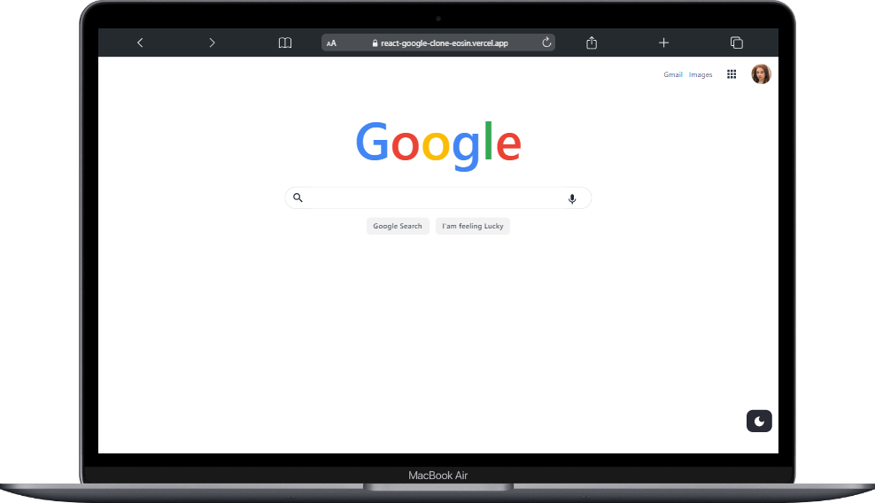
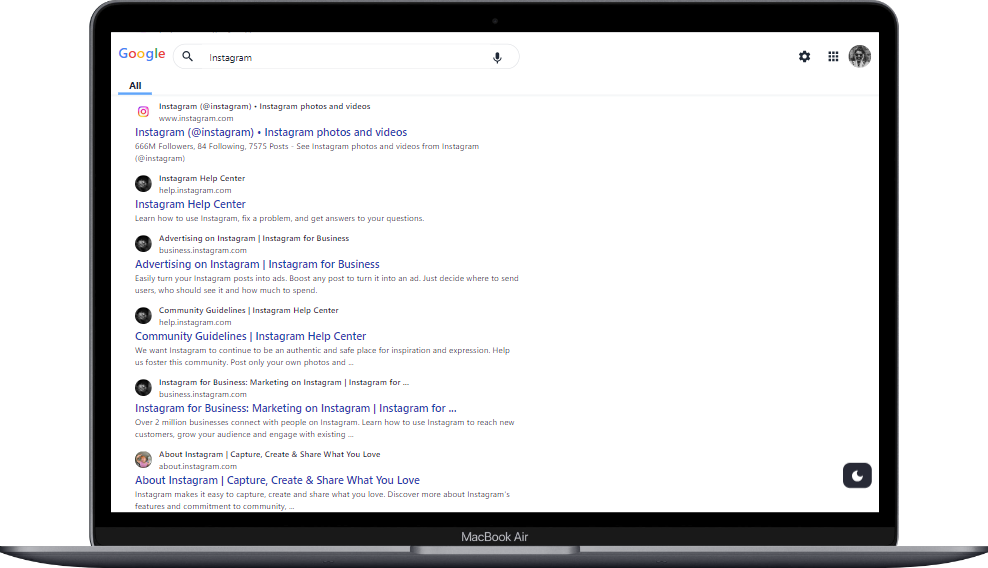
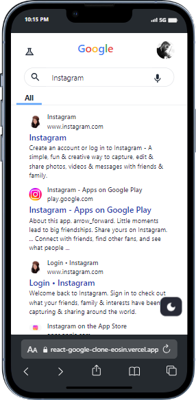

# React Google Clone

This project is a clone of google search Engine. In this we use google custom search api for getting api result


## Tables of Content

- [Overview](#overview)
  - [Screenshot](#screenshot)
  - [Links](#links)
- [My process](#my-process)
  - [Built with](#built-with)
- [Features](#Features)


### Screenshot







### Links

- Live Site URL: [Add live site URL here](https://react-google-clone-eosin.vercel.app/)


## My process

### Built with

- Semantic HTML5 markup
- CSS custom properties
- Flexbox
- CSS Grid
- Mobile-first workflow
- [React](https://react.dev/) - JS library
- [Tailwind CSS](https://tailwindcss.com/) - A CSS Framework
- [React Router Dom](https://www.npmjs.com/package/react-router-dom) - For  routing in react
- [Daisy ui](https://daisyui.com/) - A component library for tailwindcss
- [mui icons](https://mui.com/material-ui/material-icons/) - For icons


## Features

- Light/dark mode 
- Fullscreen mode
- Cross platform


## Run Locally

Clone the project

```bash
  git clone https://github.com/faisgit/react-google-clone-.git
```

Go to the project directory

```bash
  cd my-project
```

Install dependencies

```bash
  npm install
```

Start the server

```bash
  npm run dev
```


## Lessons Learned

From this project I used to learned how to use context api for state management in react js 


## License

[MIT](https://choosealicense.com/licenses/mit/)


